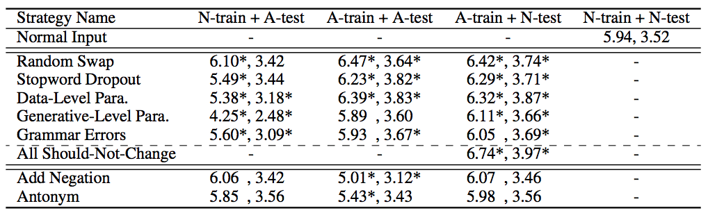

# Adversarial Over-Sensitivity and Over-Stability Strategies for Dialogue Models (CoNLL 2018)

Authors' implementation of "Adversarial Over-Sensitivity and Over-Stability Strategies for Dialogue Models" (CoNLL 2018) in TensorFlow (the code was built upon TF 1.4, but any version later than that should also work). Note that if you use any Python version <= 3.5, you will need to manually change all [formatted string literals](https://docs.python.org/3/reference/lexical_analysis.html#f-strings).

Includes code for adversarial testing and training of the VHRED model.

Authors: Tong Niu, Mohit Bansal

## Adversarial Testing

(1) Download the preprocessed version of [Ubuntu Dialogue Corpus](http://www.iulianserban.com/Files/UbuntuDialogueCorpus.zip), 
and put it under data/raw/.

(2) To generate the raw adversarial data for each strategy, run
```
python3 src/basic/generate_raw_adv.py [strategy]
```
where "strategy" is one of "random_swap", "stopword_dropout", "data_level_paraphrasing", "grammar_errors", "add_not" and "antonym".

Note that to generate raw adversarial data for the Generative-level Paraphrasing strategy,
download the implementation of the [Pointer-Generator model](https://github.com/abisee/pointer-generator) by [See et al. (2017)](https://arxiv.org/abs/1704.04368), 
and train on the [ParaNMT-5M dataset](https://drive.google.com/file/d/19NQ87gEFYu3zOIp_VNYQZgmnwRuSIyJd/view).
After training, feed the contexts of the Ubuntu dataset to the trained model, and put the outputs under data/raw/.

(3) To index any raw data, run
```
python3 src/basic/preprocess.py [strategy]
```
where "strategy" is one of "normal_input", "random_swap", "stopword_dropout", "data_level_paraphrasing", "grammar_errors", "add_not" and "antonym".

(4) To train the VHRED model by [Serban et al. 2016](https://arxiv.org/abs/1605.06069) from scratch, run
```
python3 src/main.py vhred --batch_size [batch_size]  
```
Alternatively, you can download our [pre-trained checkpoint](https://drive.google.com/open?id=1ALmWLqvXdXj4LZylh0phuLCHJjSOjuYD) and put them under ckpt/

(5) To test the VHRED model on the normal input and each adversarial strategy, run
```
python3 src/main.py vhred --test_strategy [strategy] --start_epoch [start_epoch] --batch_size [batch_size]
```
where "strategy" is one of "normal_input", "random_swap", "stopword_dropout", "data_level_paraphrasing", "grammar_errors", "add_not" and "antonym", and "start_epoch" is the epoch to restore from.

(6) To obtain the F1 scores for outputs generated based on the normal input and each adversarial strategy,
use the [evaluation code](https://github.com/julianser/Ubuntu-Multiresolution-Tools) by [Serban et. al. (2018)](https://arxiv.org/abs/1606.00776) on the output generated by testing on each adversarial strategy.

(7) Expected Results:
The model should obtain the following results ("N" stands for "Normal" and "A" stands for "Adversarial"):


# Adversarial Training

(1) To train on each adversarial strategy, run
```
python3 src/main.py vhred --train_strategy [strategy] --start_epoch [start_epoch] --batch_size [batch_size]
```
where "strategy" is one of "normal_input", "random_swap", "stopword_dropout", "data_level_paraphrasing", "grammar_errors", "all_should_not_change", "add_not" and "antonym", and "start_epoch" is the epoch to restore from.

(2) To test on the trained adversarial model, run
```
python3 src/main.py vhred --train_strategy [strategy] --test_strategy [strategy] --start_epoch [start_epoch] --batch_size [batch_size]
```
## Citations

If you happen to use our work, please consider citing our paper.
If you happen to use our work, please consider citing our paper.

```
@inproceedings{niu2018adversarial,
	author = {Niu, Tong  and Bansal, Mohit},
	title = {Adversarial Over-Sensitivity and Over-Stability Strategies for Dialogue Models},
	booktitle = {The SIGNLL Conference on Computational Natural Language Learning (CoNLL)},
	year = {2018},
}
```
